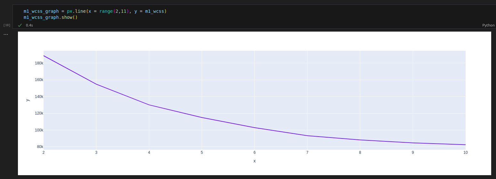
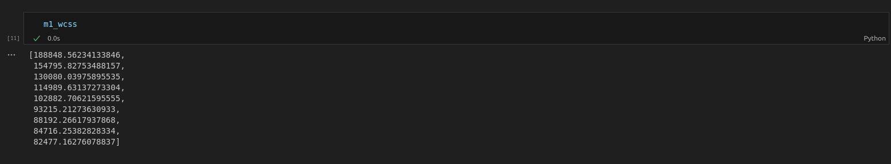
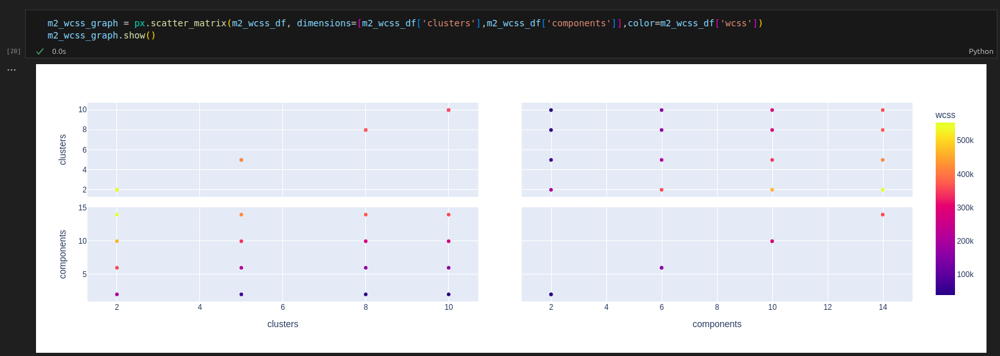
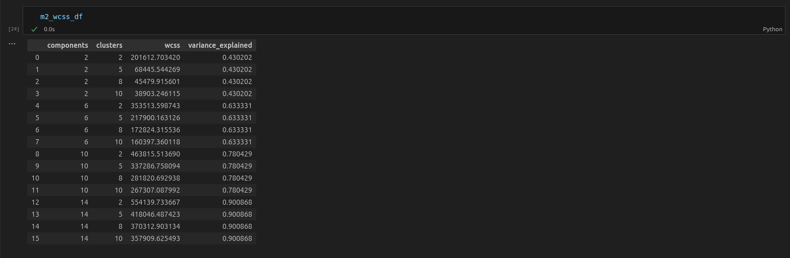
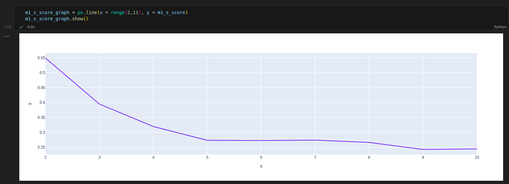
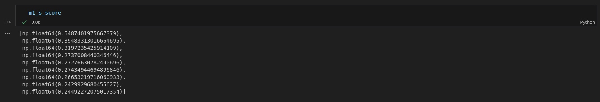
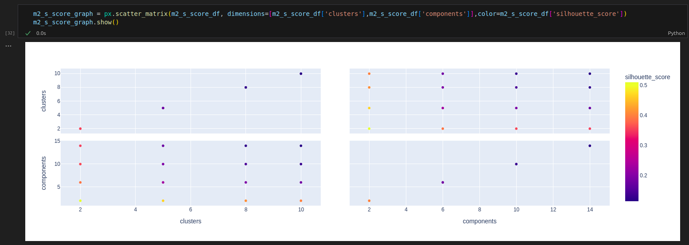
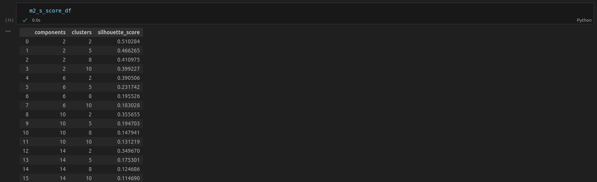

# Kmeans algorithm

## Dependencies
- pandas
- plotly
- sklearn
- pickle

## Overview

K-Means is a unsupervised learning, clustering algorithm that partitions a dataset into k distinct, non-overlaping groups based on feature similarity by calculating the euclidean distance between instances using its numerical features.

## Performance Analysis
**Elbow Method (WCSS)**

- *Manual Engineering (Method A):*

          

Observation: Smooth graph curve with elbow on K=7 

- *PCA (Method B):*

          

Observation: Best performance with 2 components with a steeper curve suggesting efficiency on crunching similar data on smaller and more concise clusters

**Silhouette Score**

- *Manual Engineering (Method A):*

           

Observation: Peak score 0.548 with 2 clusters

- *PCA (Method B):*

           

Observation: Peak score 0.510 with 2 clusters and 2 components

## Key Takeaways

**Metric Behavior (WCSS vs. Silhouette):**
- **WCSS:** Showed peak cost-benefit around 7 clusters. However, WCSS only measures compactness (distance to centroid).
- **Silhouette Score:** Favored 2 clusters. This suggests the data naturally separates into two distinct groups (likely "Defaulters" and "Non-Defaulters").

**Manual vs PCA:**
- **Manual Engineering:** Achieved higher Silhouette scores overall. This indicates that our domain-specific feature aggregation preserved the cluster structure better than linear dimensionality reduction.
- **PCA Performance:** While it lowered the score, PCA showed better optimization curves as cluster counts increased. It effectively grouped similar data points but struggled to maintain the distinct separation between the major groups compared to the manual method.
